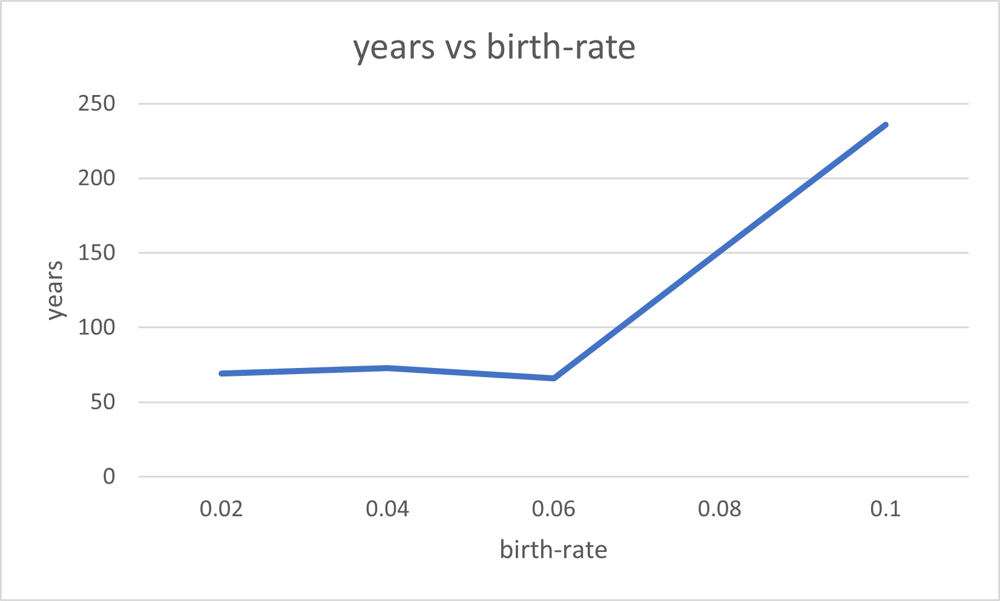
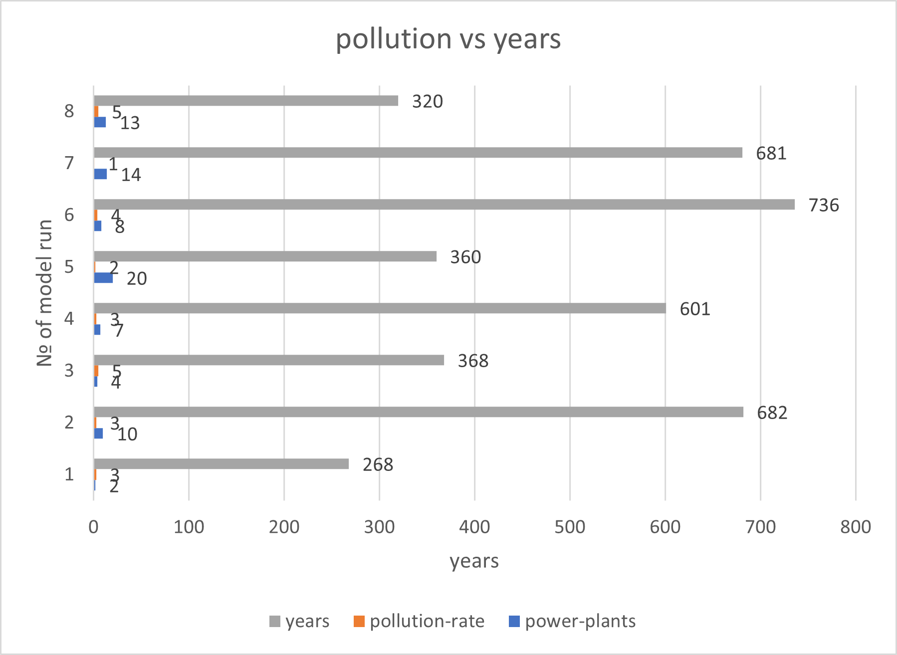
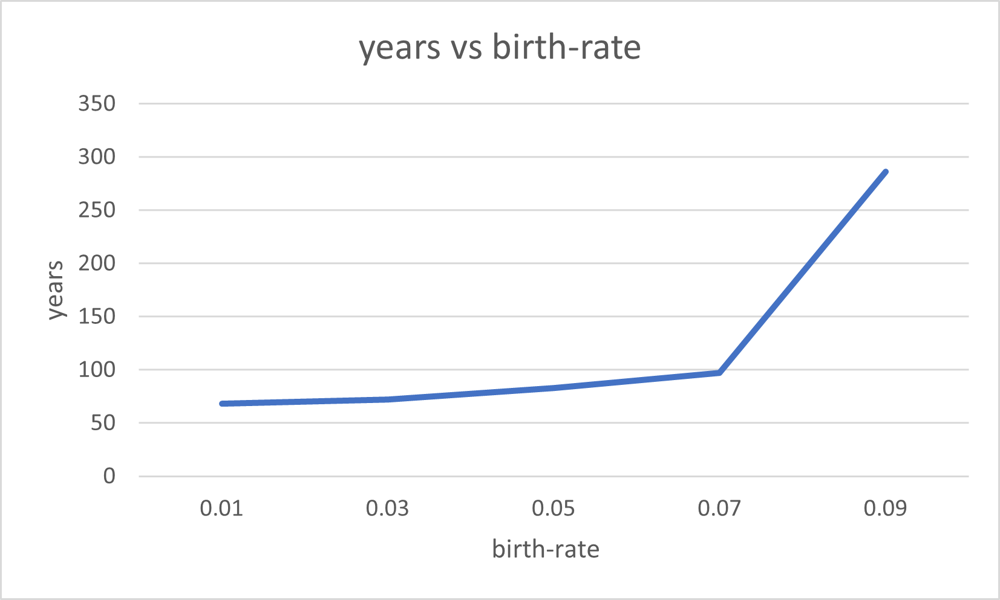

## Комп'ютерні системи імітаційного моделювання
## СПм-22-5, **Братищенко Микита Русланович**
### Лабораторна робота №**1**. Опис імітаційних моделей та проведення обчислювальних експериментів

 

### Варіант 4, модель у середовищі NetLogo:
[Urban Suite - Pollution](https://www.netlogoweb.org/launch#http://www.netlogoweb.org/assets/modelslib/Curricular%20Models/Urban%20Suite/Urban%20Suite%20-%20Pollution.nlogo)

 

### Вербальний опис моделі:
Ця модель досліджує крихку рівновагу екосистеми "хижак - жертва". Популяції людей, елементів ландшафту(дерев) та осередків забруднювачів повітря(електростанції) конкурують за ресурси в закритому середовищі. Використовуючи цю модель, можна дослідити поведінку популяцій у часі, оскільки вони динамічно взаємодіють один з одним: хижаків (забруднення) і жертв (людей) можна порівнювати протягом кількох поколінь, оскільки їхні популяції демонструють регулярний або нерегулярний репродуктивний успіх.

Регулярні коливання (цикли) чисельності популяцій свідчать про баланс і стабільність в екосистемі, де, незважаючи на коливання, популяції підтримують себе протягом тривалого часу. І навпаки, нерегулярні коливання вказують на нестабільність, що веде до потенційного вимирання обох взаємозалежних популяцій. Модель встановлює петлю негативного зворотного зв'язку: хижаки пригнічують щільність здобичі, а здобич стимулює щільність хижаків.

### Керуючі параметри:
- **initial-population** Визначає популяцію людей у середовищі моделювання, тобто, в даній моделі, початкову кількість людей.
- **birth-rate**. Контролює відсоток народжуванності людей, тобто вірогідність з якою люди будуть розмножуватись і народжувати дітей. Початковий показник 0,1 означає, що у них з вірогідністю в 10% може народитись дитина щороку, за умови, що вони достатньо здорові. Для того, щоб мати дітей, люди повинні мати 4 бали здоров'я або більше, і щороку вони втрачають по 0,1 балу. Це означає, що вони мають щонайбільше 10 років для відтворення, і навіть менше, якщо вони постраждали від забруднення. Значення за замовчуванням дуже близьке до "коефіцієнта відтворення", що означає, що в середньому кожна людина має одну дитину.
- **planting-rate** Контролює ймовірність того, що людина посадить дерево щороку. Значення за замовчуванням 0,05 означає, що людина має 5% вірогідність посадки дерева. Дерева живуть 50 років і ніколи не відтворюють(відновлюють) себе. У цьому сенсі вони не є деревами в буквальному сенсі, але представляють будь-який механізм очищення від забруднення.
- **power-plants** Це значення відповідає за кількість побудованих електростанцій на початку роботи моделі.
- **pollution-rate** Це забруднення, яке кожна електростанція виробляє за рік. Потім воно поширюється на навколишню територію.

 
### Внутрішні параметри:
#### Глобальні
- **people**. Кількість людей. Може як збільшуватись (в результаті розмноження і народження дітей) так і зменшуватись (в результаті забруднення середовища або через старіння і в результаті смерть).
- **trees**. Кількість дерев, які посадили люди (вони не можуть відновлювати себе і з часом гинуть).
- **pollution**. Рівень забруднення навколишнього середовища в результаті роботи електростанцій (але його можуть зменшувати посаджені дерева). 

#### Для кожного агента
- **health**. Рівень здоров'я людей. На нього негативно впливає рівень забруднення (але висаджування дерев допомагає зменшити його негативні наслідки). Якщо він = 0 то людина помирає. При достатньому показникові здоров'я (більше 4) людина може розмножуватись з певною ймовірністю. Але щороку люди втрачають по 0.1 бали здоров'я(з природних причин).
- **is-power-plant?**. Флаг який вказує на те що електростанція активна та призводить до забруднення навколишьного середовища (якщо true) або ні (якщо false).

### Показники роботи системи:
- Кількість людей. Змінюється кожного такту.
- Кількість дерев, які посаджені людьми. Змінюється кожного такту.
- Рівень забруднення навколишнього середовища. Змінюється кожного такту.

### Примітки:
Тривалість роботи моделі залежить від початкових параметрів і того, як довго людство проживе (тобто допоки кількість людей не буде 0).

### Недоліки:
Так як завершенням симуляції вважається вимирання популяції людей на протязі певного періоду часу (тіків) - тобто кількість людей повинна дорівнювати 0, при певних початкових умовах симуляція може йти нескінченно. Наприклад, велика ймовірність розмноження чи посадки дерев, разом з одночасно низькими значеннями рівня забруднення та електростанціями призведуть до стрімкого експотенційного збільшення популяції людей що призведе до "зависання" моделі.

 

## Обчислювальні експерименти
### 1. Вплив ймовірності розмноження людей на тривалість виживання популяції.
Досліджується залежність швидкості генерації кінцевого результату, тобто часу виживання популяції людей аж до її зникнення (**years**) від ймовірності розмноження людей та народження дітей (**birth-rate**) при стандартних значеннях інших керуючих параметрів для даної моделі.
Експерименти проводяться зі значеннями параметру (**birth-rate**) в такому проміжку: 0.02 - 0.1 з шагом у 0.02.
У якості значення часу, який знадобився для генерації результату, буде братись значення в роках (**years**) в той момент, коли кількість людей (**people**) буде дорівнювати 0.
Інші керуючі параметри:
- **initial-population**: 30
- **planting-rate**: 0.05
- **power-plants**: 2
- **polution-rate**: 3

<table>
<thead>
<tr><th>Ймовірність розмноження людей</th><th>Час існування людства (в роках)</th></tr>
</thead>
<tbody>
<tr><td>0.02</td><td>69</td></tr>
<tr><td>0.04</td><td>73</td></tr>
<tr><td>0.06</td><td>66</td></tr>
<tr><td>0.08</td><td>151</td></tr>
<tr><td>0.1</td><td>236</td></tr>

</tbody>
</table>

Графік наочно показує, що при стандартних значеннях параметрів моделі, час існування людства не сильно змінюється при значеннях (**birth-rate**) від 0.02 до 0.06. Проте починаючи з 0.06 час існування людства стрімко збільшується, тим самим спостерігаємо лінійну залежність між народжуванністю та тим як довго популяція людей буде існувати.

### 2. Вплив кількості електростанцій та рівня забруднення на час існування людства.
Досліджується залежність швидкості генерації кінцевого результату, тобто часу виживання популяції людей аж до її зникнення (**years**) від кількості електростанцій (**power-plants**) а також рівня забруднення природи, яке є наслідком роботи електростанцій (**pollution-rate**). При тому, що під час прогону моделі, значення народжуванності дітей (**birth-rate**) буде дорівнювати 0.01. 
Експерименти проводяться зі значеннями параметру (**power-plans**) в такому проміжку: 2 - 20. Також змінним є і параметр (**pollution-rate**) в проміжку: 1 - 5.
У якості значення часу, який знадобився для генерації результату, буде братись значення в роках (**years**) в той момент, коли кількість людей (**people**) буде дорівнювати 0.

Інші керуючі параметри:
- **initial-population**: 30
- **planting-rate**: 0.05
- **birth-rate**: 0.1

<table>
<thead>
<tr><th>Кількість електростанцій</th><th>Рівень забруднення</th><th>Час існування людства (в роках)</th></tr>
</thead>
<tbody>
<tr><td>2</td><td>3</td><td>268</td></tr>
<tr><td>10</td><td>3</td><td>682</td></tr>
<tr><td>4</td><td>5</td><td>368</td></tr>
<tr><td>7</td><td>3</td><td>601</td></tr>
<tr><td>20</td><td>2</td><td>360</td></tr>
<tr><td>8</td><td>4</td><td>736</td></tr>
<tr><td>14</td><td>1</td><td>681</td></tr>
<tr><td>13</td><td>5</td><td>320</td></tr>

</tbody>
</table>

На даній гістограмі спостерігаємо результати 8 експериментів (прогонів моделі) і те, як змінувався час існування популяції людей при змінні значень кількості електростанцій (**power-plants**) а також рівня забруднення природи (**pollution-rate**). Можна зробити висновки, що є зворотньо пропорційна залежність: чим більше електростанцій або рівня забруднення (або навіть і того і того) тим менше років проживає людський рід. І навпаки, чим менше електростанцій та забруднення тим більше часу буде існувати популяція (на це також впливають і дерева, які в певній мірі нівелюють негативні наслідки забруднення на здоров'є людей).

### 3. Вплив ймовірності народжуванності на існування популяції людей при відсутності електростанцій а також нульовій ймовірності посадження дерев людьми.
Досліджується залежність швидкості генерації кінцевого результату, тобто часу виживання популяції людей аж до її зникнення (**years**) від ймовірності розмноження людей та народження дітей (**birth-rate**) при умовах, що кількість електростанцій (**power-plants**) та ймовірність посадки дерев людьми (**planting-rate**) будуть дорівнювати 0. Тобто, на результати експерименту не будуть впливати ані електростанції з забрудненням навколишнього середовища; ані дерева, які зменшують негативні наслідки викидів.
Експерименти проводяться зі значеннями параметру (**birth-rate**) в такому проміжку: 0.03 - 0.09.
У якості значення часу, який знадобився для генерації результату, буде братись значення в роках (**years**) в той момент, коли кількість людей (**people**) буде дорівнювати 0.
Інші керуючі параметри:
- **initial-population**: 50
- **planting-rate**: 0
- **power-plants**: 0
- **polution-rate**: 0

<table>
<thead>
<tr><th>Ймовірність розмноження людей</th><th>Час існування людства (в роках)</th></tr>
</thead>
<tbody>
<tr><td>0.01</td><td>68</td></tr>
<tr><td>0.03</td><td>72</td></tr>
<tr><td>0.05</td><td>83</td></tr>
<tr><td>0.07</td><td>97</td></tr>
<tr><td>0.09</td><td>286</td></tr>

</tbody>
</table>

На графіку видно, що на проміжку значеннь народжуванності від 0.01 до 0.07 популяція виживає не дуже багато часу (приблизно до 100 років). Але починаючи з народжуванності 0.07 і вище, у людства значно більше шансів на виживання на протязі тривалих років шляхом розмноження (на графіку можна побачити лінійну залежність).
Під час прогону моделі було помічено, що на кожних 50 тіках (роках) популяція стрімко падала. Але якщо людей було достатньо для розмноження і її ймовірність була достатньою, кількість людей знову починала рости. В протилежному випадку кількість людей добігала до нуля, тим самим моделювання підходило до кінця. Можна припустити, що 50 років це середня тривалість життя людини в даній моделі, і після цього порогу люди вмирають з природних причин (до цього також може призводити періодичне зменшення здоров'я на 0.1).