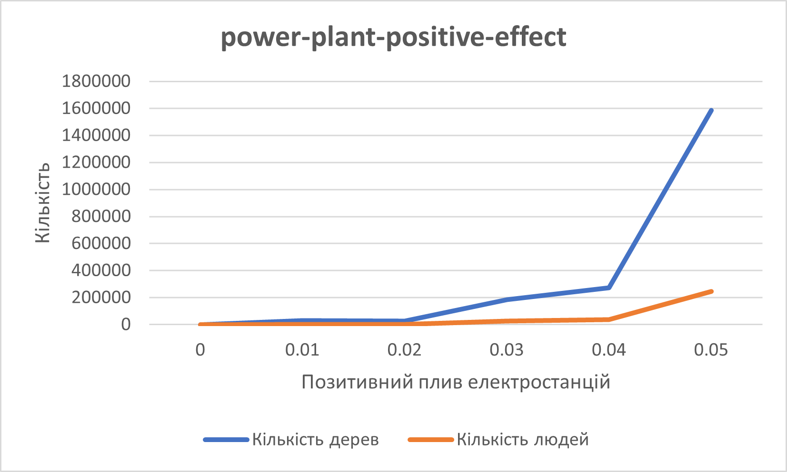

## Комп'ютерні системи імітаційного моделювання
## СПм-22-5, **Братищенко Микита Русланович**
### Лабораторна робота №**2**. Редагування імітаційних моделей у середовищі NetLogo

 

### Варіант 4, модель у середовищі NetLogo:
[Urban Suite - Pollution](https://www.netlogoweb.org/launch#http://www.netlogoweb.org/assets/modelslib/Curricular%20Models/Urban%20Suite/Urban%20Suite%20-%20Pollution.nlogo)

 

#### Внесені зміни у вихідну логіку моделі, за варіантом:

**Реалізовано позитивний вплив наявності електростанцій на вірогідність появи нових людей. Додано нову змінну 'power-plant-positive-effect' (діапазон 0-0.1 з кроком 0.01) у властивостях клітин, яка збільшує ймовірність народження нових людей:**

<pre>
patches-own [
  pollution
  is-power-plant?
  power-plant-positive-effect
]
</pre>
Зміна процедури розмноження людей, враховуючи нову зміну 'power-plant-positive-effect'
<pre>
to reproduce  ;; person procedure
  if health > 4 and random-float 1 < power-plant-positive-effect + birth-rate[
    hatch-people 1 [
      set health 5
    ]
  ]
end
</pre>

Зміна процедури висадки дерев у клітинах поблизу електростанцій з використанням змінної 'power-plant-positive-effect':
<pre>
to maybe-plant  ;; person procedure
  if random-float 1 < power-plant-positive-effect + planting-rate [
    hatch-trees 1 [
      set health 5
      set color green
    ]
  ]
end
</pre>

Додана властивість power-plant-positive-effect для клітин, щоб відслідковувати вплив електростанцій на них. Електростанції тепер впливають на сусідні клітинах, збільшуючи вірогідність висадки дерев та народження нових людей.

### Внесені зміни у вихідну логіку моделі, на власний розсуд:
### Додання більше випадковості в процеси роботи моделі

В процедурі **reproduce** змінено кількість народжуваних дітей - тепер замість 1 буде випадково народжуватись від 1 до 3 дітей.
<pre>
to reproduce  ;; person procedure
  if health > 4 and random-float 1 < power-plant-positive-effect + birth-rate [
    hatch-people random 3 [
      set health 5
    ]
  ]
end
</pre>

В процедурі **maybe-plant** змінено скільки дерев може посадити людина - тепер замість 1 людина може посадити від 1 до 10 дерев.
<pre>
to maybe-plant  ;; person procedure
  if random-float 1 < power-plant-positive-effect + planting-rate[
    hatch-trees random 10 [
      set health 5
      set color green
    ]
  ]
end
</pre>

### Реалізація випадкової (або природньох) смерті людини шляхом додання нового керуючого параметра "probability-of-suddenly-death" (діапазон 0-1 з кроком 0.01). 

Розроблена процедура **maybe-suddenly-die** описує випадковий шанс того, що людина може вмерти з тих чи інших причин (природня смерть, дтп та ін.) враховуючи значення параметру **probability-of-suddenly-death**
<pre>
to maybe-suddenly-die
  if random-float 1 < probability-of-suddenly-death 
  [die]
end 
</pre>

Модифікація процедури **go** можелі шляхом додання використання нової процедури таким чином: в кожен момент часу (тік) для одної випадкової людини(one of turtles) буде виклик функції **maybe-suddenly-die**. Але за умови що кількість людей не дорівнює 0.
<pre>
  if any? people [
    ask one-of people [
      maybe-suddenly-die
    ]
  ]
</pre>

### Обчислювальний експеримент
Досліджується залежність народжуванності людей і посадки дерев від позитивного впливу електростанцій (станом на 100 тік симуляції)
Експерименти проводяться при значеннях позитивного впливу електростанцій від 0 до 0.05, з кроком 0.01, усього 6 симуляцій.  
Інші керуючі параметри мають значення за замовчуванням:
- **initial-population**: 30
- **birth-rate**: 0.1
- **power-plants**: 3
- **polluting-rate**: 2
- **planting-rate**: 0.07
- **probability-of-suddenly-death**: 0.1
<table>
<thead>
<tr><th>Позитивний вплив електростанцій</th><th>Кількість дерев</th><th>Кількість людей</th></tr>
</thead>
<tbody>
<tr><td>0</td><td>712</td><td>1</td>
<tr><td>0.01</td><td>31037</td><td>2911</td>
<tr><td>0.02</td><td>25594</td><td>2342</td>
<tr><td>0.03</td><td>184594</td><td>24784</td>
<tr><td>0.04</td><td>272802</td><td>38303</td>
<tr><td>0.05</td><td>1587019</td><td>243909</td>
</tbody>
</table>

В результаті експерименту можна зробити висновок, що введення позитивного впливу електростанцій на розмноження людей і посадку дерев збільшує в рази значення кількості людей і дерев під час симуляції.

Фінальний код моделі та її інтерфейс доступні за [посиланням](changed-source-code.nlogo).
 
