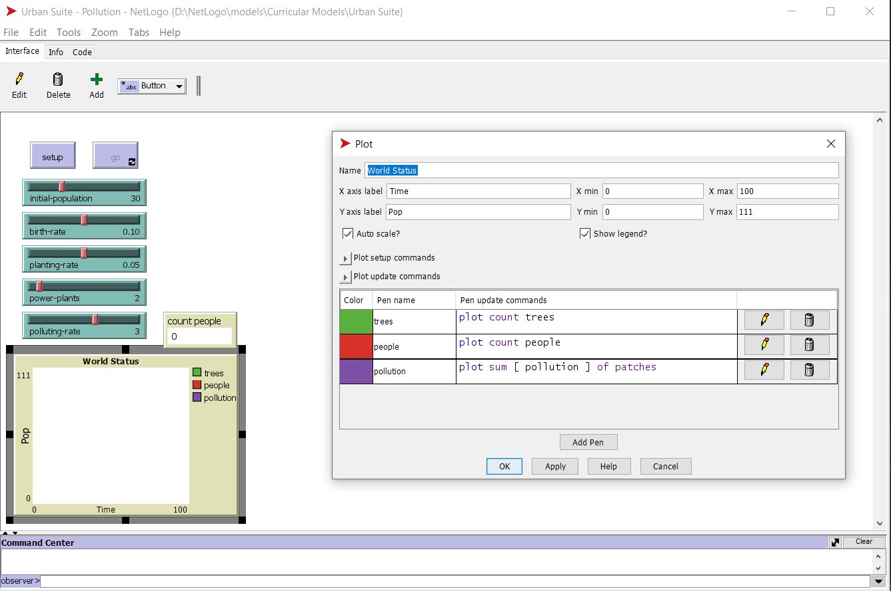
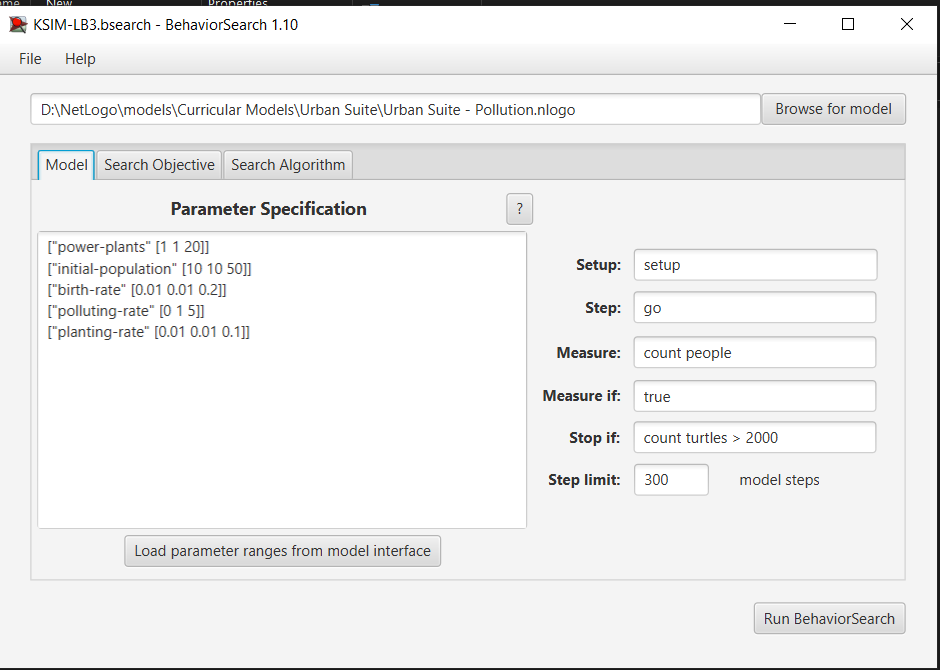
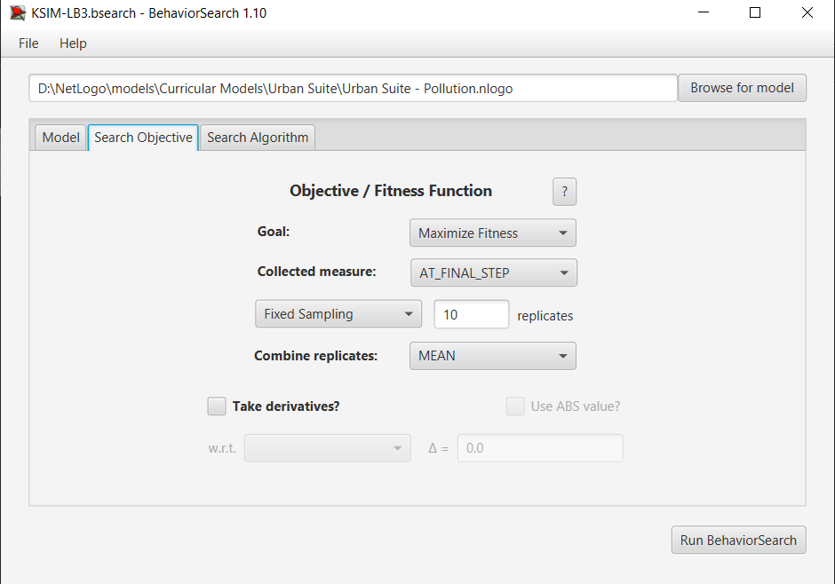
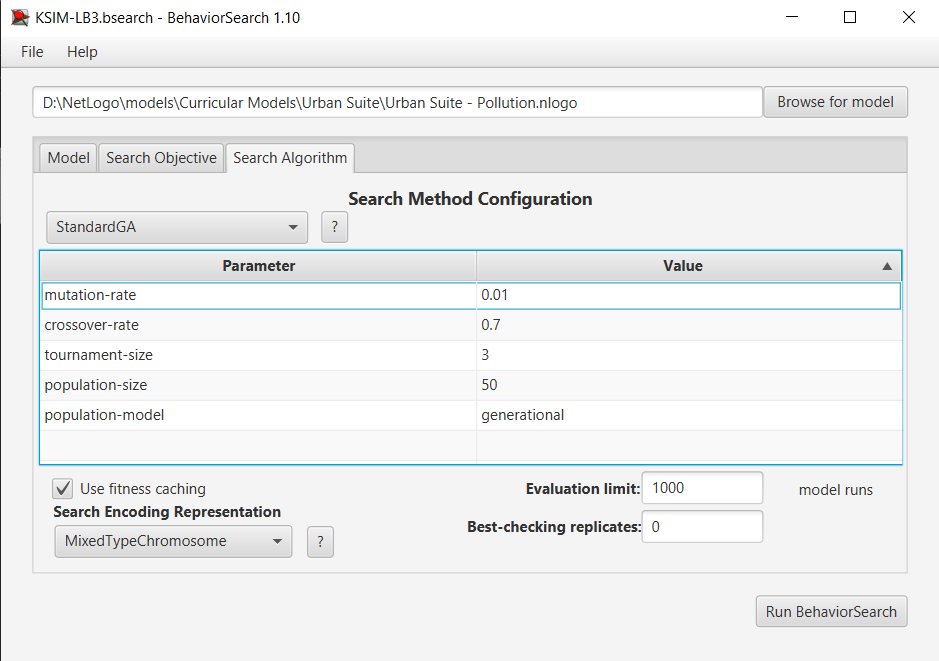
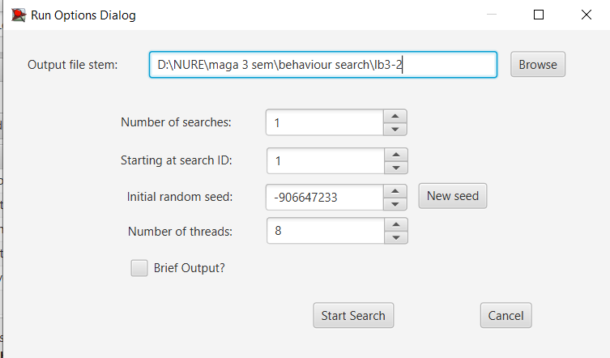
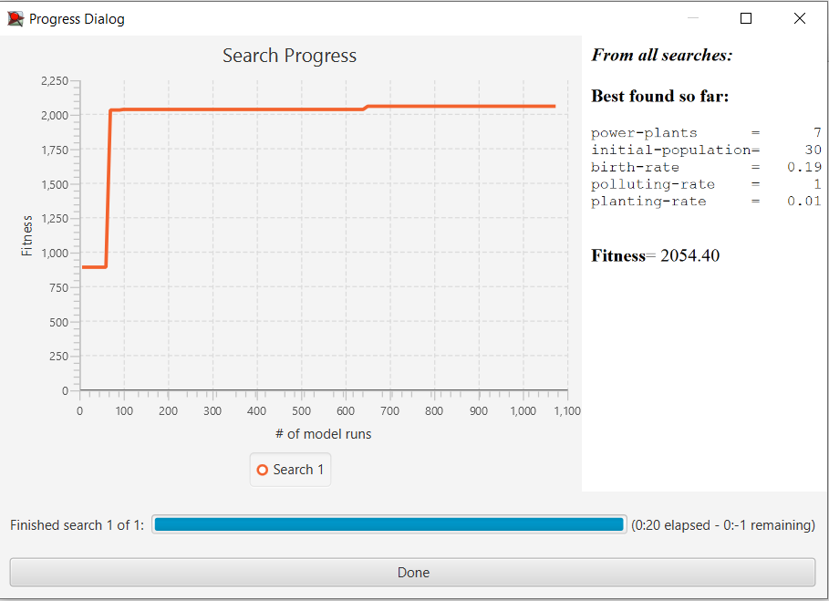
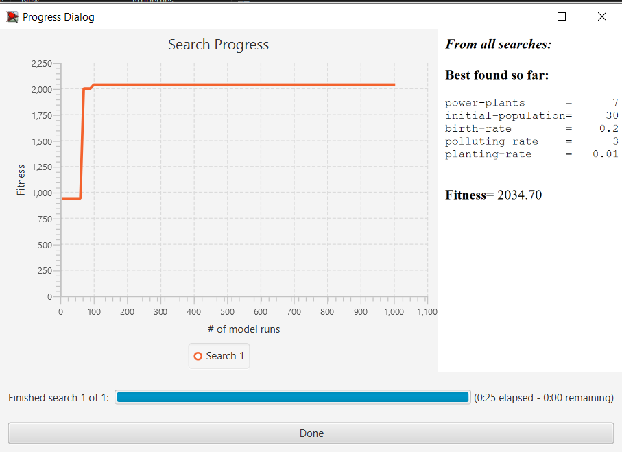
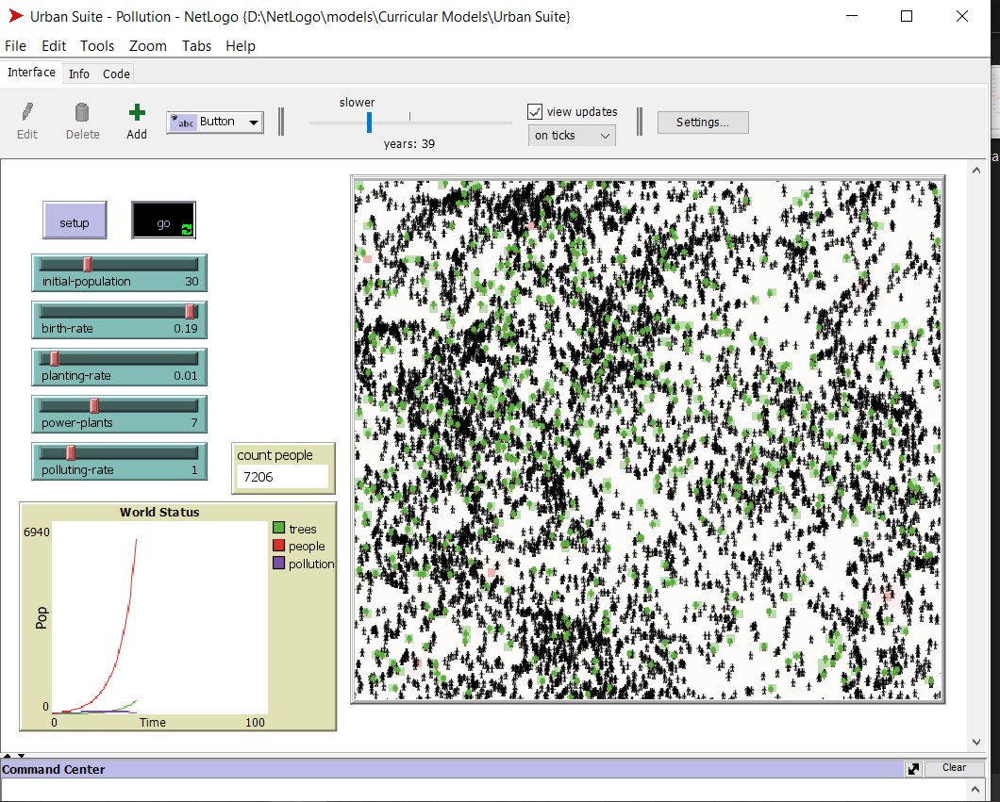
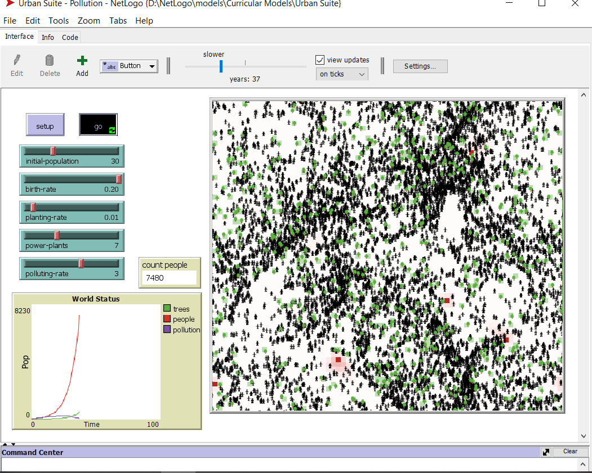

## Комп'ютерні системи імітаційного моделювання
## СПм-22-5, **Братищенко Микита Русланович**
### Лабораторна робота №**3**. Використання засобів обчислювального интелекту для оптимізації імітаційних моделей

 

### Варіант 4, модель у середовищі NetLogo:
[Urban Suite - Pollution](https://www.netlogoweb.org/launch#http://www.netlogoweb.org/assets/modelslib/Curricular%20Models/Urban%20Suite/Urban%20Suite%20-%20Pollution.nlogo)

 

#### Вербальний опис моделі:
[Опис моделі наведено в 1 ЛР](https://github.com/Bosabom/ksim-lb/tree/main/ksim%201%20lb)

### Керуючі параметри:
- **initial-population** Визначає популяцію людей у середовищі моделювання, тобто, в даній моделі, початкову кількість людей.
- **birth-rate**. Контролює відсоток народжуванності людей, тобто вірогідність з якою люди будуть розмножуватись і народжувати дітей. Початковий показник 0,1 означає, що у них з вірогідністю в 10% може народитись дитина щороку, за умови, що вони достатньо здорові. Для того, щоб мати дітей, люди повинні мати 4 бали здоров'я або більше, і щороку вони втрачають по 0,1 балу. Це означає, що вони мають щонайбільше 10 років для відтворення, і навіть менше, якщо вони постраждали від забруднення. Значення за замовчуванням дуже близьке до "коефіцієнта відтворення", що означає, що в середньому кожна людина має одну дитину.
- **planting-rate** Контролює ймовірність того, що людина посадить дерево щороку. Значення за замовчуванням 0,05 означає, що людина має 5% вірогідність посадки дерева. Дерева живуть 50 років і ніколи не відтворюють(відновлюють) себе. У цьому сенсі вони не є деревами в буквальному сенсі, але представляють будь-який механізм очищення від забруднення.
- **power-plants** Це значення відповідає за кількість побудованих електростанцій на початку роботи моделі.
- **pollution-rate** Це забруднення, яке кожна електростанція виробляє за рік. Потім воно поширюється на навколишню територію.

### Показники роботи системи:
- Кількість людей. Змінюється кожного такту.
- Кількість дерев, які посаджені людьми. Змінюється кожного такту.
- Рівень забруднення навколишнього середовища. Змінюється кожного такту.

 

### Налаштування середовища BehaviorSearch:

**Обрана модель**:
<pre>
D:\NetLogo\models\Curricular Models\Urban Suite\Urban Suite - Pollution.nlogo
</pre>
**Параметри моделі** (вкладка Model):  
*Параметри та їх модливі діапазони були **автоматично** вилучені середовищем BehaviorSearch із вибраної імітаційної моделі, для цього є кнопка «Завантажити діапазони параметрів із інтерфейсу моделі»*:
<pre>
["power-plants" [1 1 20]]
["initial-population" [10 10 50]]
["birth-rate" [0.01 0.01 0.2]]
["polluting-rate" [0 1 5]]
["planting-rate" [0.01 0.01 0.1]]
</pre>
*Початкова кількість людей була дещо змінена мною, в порівнянні зі значенням за замовчуванням, для скорочення часу симуляції. А також змінено мінімальні значення параметрів **power-plants**, **birth-rate** та **planting-rate** задля більшого реалізму під час роботи моделі (тобто виключення таких варіантів: відсутність електростанцій, нульові ймовірності народжуванності дітей та посадки дерев)*  
Використовувана **міра**:  
Для фітнес-функції *(вона ж функція пристосованості або цільова функція)* було обрано **кількість людей**, вираз для її розрахунку взято з налаштувань графіка аналізованої імітаційної моделі в середовищі NetLogo  
  
та вказано у параметрі "**Measure**":
<pre>
count people 
</pre>
Під час "прогону моделі" враховується кількість людей **count people** і те, як ті чи інші фактори (народжуванність, забруднення в результаті роботи електростанцій, посадка дерев) впливають на зміну цього значення у кожен такт часу. Пошук буде виконуватись з обмеженням у 300 тактів роботи моделі (років) починаючи з 0 такту симуляції.  
*Параметр "**Mesure if**" зі значення true, по суті, і означає, що враховуватимуться всі такти симуляції, а чи не частина їх.
Параметри "**Setup**" та "**Go**" вказують відповідні процедури ініціалізації та запуску в логіці моделі (зазвичай вони так і називаються). BehaviorSearch в процесі роботи, по суті, замість користувача запускає ці процедури.*  
Параметр зупинки за умовою ("**Stop if**") налаштовуємо таким чином, щоб при досягненні популяції людей у кількості 2000 осіб пошук зупиняється.  
Загальний вигляд вкладки налаштувань параметрів моделі:  

**Налаштування цільової функції** (вкладка Search Objective):  
Метою підбору параметрів імітаційної моделі, що описує виживання популяції людей враховуючи певні чинники реального світу, є **максимізація** значення кількості людей це вказано через параметр "**Goal**" зі значенням **Maximize Fitness**. Тобто необхідно визначити такі параметри налаштувань моделі, у яких людство досягне максимально можливої популяції під кінець симуляції (тривалість якої (300 кроків - по суті років) вказувалася на минулій вкладці). Для цього у параметрі "**Collected measure**", що визначає спосіб обліку значень обраного показника, вказано **AT_FINAL_STEP**.  
Щоб уникнути викривлення результатів через випадкові значення, що використовуються в логіці самої імітаційної моделі, **кожна симуляція повторюється по 10 разів**, результуюче значення розраховується як **середнє арифметичне**.  
Загальний вигляд вкладки налаштувань цільової функції:  

**Налаштування алгоритму пошуку** (вкладка Search Algorithm):  
*На цьому етапі було визначено модель, налаштовано її параметри (тобто вказано, які в процесі пошуку можуть змінюватися і в яких діапазонах), і обрано міру, що лежить в основі функції пристосованості, що дозволяє оцінити якість кожного перевіряємого BehaviorSearch варіантів рішення.  
У ході дослідження на лабораторній роботі використовуються два алгоритми: Випадковий пошук(**RandomSearch**) і Простий генетичний алгоритм (**StandardGA**).  
Для цих алгоритмів, що вирішують завдання пошуку такого набору параметрів імітаційної моделі, щоб задовольнити вимоги користувача (у нашому випадку – максимізувати значення кількості людей - агентів у заданій імітаційній моделі), вказуємо що "**Evaluation limit**" = **1000** (число ітерацій пошуку, у разі ГА – це буде кількість поколінь), та "**Search Space Encoding Representation**" = **MixedTypeChromosome** (спосіб кодування варіанта вирішення). 
Параметр "**Use fitness caching**" впливає лише на продуктивність.
Параметри, специфічні для генетичного алгоритму, використовуємо за замовчанням.*  
Загальний вид вкладки налаштувань алгоритму пошуку:  

 

### Результати використання BehaviorSearch:
Діалогове вікно запуску пошуку:  

 

Результат пошуку параметрів імітаційної моделі, використовуючи **генетичний алгоритм**:  

Результат пошуку параметрів імітаційної моделі, використовуючи **випадковий пошук**:  

 

### Перевірка знайдених значеннь параметрів для імітаційної моделі у NetLog:

Скріншот роботи імітаційної моделі при значеннях параметрів, які були отримані в результаті **генетичного алгоритму**:  
 

 

Скріншот роботи імітаційної моделі при значеннях параметрів, які були отримані в результаті **випадкового пошуку**: 
 

